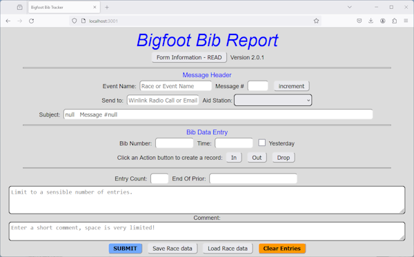

# Bigfoot Bib Report Winlink Form

## Table of Contents

- [Overview](#overview)
- [Contributing](#contributing)
- [Form and Template Version](#form-and-template-version)
- [How Winlink Forms Work](#how-winlink-forms-work)
- [How Bib Data Is Recorded At Aid Stations](#how-bib-data-is-recorded-at-aid-stations)
- [Demonstration Form](#demonstration-form)
- [How To Use This Form](#how-to-use-this-form)
- [Download Files To Use This Form](#download-files-to-use-this-form)
- [How to Install This Form and Template](#how-to-install-this-form-and-template)
- [Set A Favorite Form](#set-a-favorite-form)
- [Form Usage in Winlink Express](#form-usage-in-winlink-express)
- [Development](#development)
- [Final Thoughts](#final-thoughts)

## Overview

[Destination Trail](https://www.destinationtrailrun.com/) holds an ultra trail marathon event in Washington State every summer called [Bigfoot 200](https://www.destinationtrailrun.com/bigfoot). The event spans a 200+ mile course through the Gifford Pinchot National Forest and the Mt.St.Helens Volcanic Monument.

Participants are tracked as they arrive and depart (or drop out of the race) at each one of the many remote aid station sites along the route.

Hams volunteer their time and equipment to provide communications between aid station sites and race headquarters. One component of tracking runners is to capture and transmit reports of participant's bib numbers from each checkpoint. In the past this was done by voice transmissions, either simplex or a local repeater network. More recently, Winlink has become the preferred method to transfer these 'bib reports' to race coordinators via hams at the Finish line. Winlink is like 'email over ham radio', allowing more rapid transfer or large amounts of information (like bib numbers), freeing the simplex and repeater channels for other voice traffic such as requesting medical supplies, water, and so on. Hams at race HQ receives the Winlink "bib reports" and enters them into a database. The database can be cross-referenced when estimating runner arrival at specific stations, or finding when and where a runner last checked in along the route.

This form was developed to standardize the message and data to race headquarters from the many remote Aid Stations, reducing time to get the data, and simplifying data entry into the database.

For more information about Destination Trail and their ultra trail running marathons, see [DestinationTrailRun.com](https://www.destinationtrailrun.com/).

## Contributing

See [CONTRIBUTING.md](CONTRIBUTING.md) for information. You are welcome to help me, and the Bigfoot Hams, with your ideas.

## Form and Template Version

1-Aug-2024: v2.4.x (in development)

- Mouseless input: IN, OUT, DROP buttons activated using `+`, `-`, and `/` keys.
- Clear Entries button also removes Comment field text.
- Fix UI tabstops and selected highlight.
- Code cleanup and refinements.
- Code improvements for screen readers.
- Improved time input sanitization.
- Documentation updates covering the above features.

25-June-2024: v2.1.3

- Add sanitization to bib number and bib time inputs.
- Format bib time input as 'HHMM' (4 characters, no colon, no non-number characters).
- Format CSV entries as 'HHMM' etc (same as above).
- Update Form Information (help) text.

5-June-2024: v2.0.1

- Updates Template file variable names.
- Updates Form to use CSV on UI, submit Tab-delimited on Submit.
- Update README with latest instructions, images, and depictions.
- Update Form Information to match current UI and functionality.
- Bugfix Save Race data output.
- Remove and factor-out unused or unnecessary code, consolidate other code paths.
- Enforce CRLF in git operations.
- Updates code to support major desktop and mobile browsers from March 2010 forward.
- Update in-form help documentation to bring up-to-date.

6-Aug-2023: v1.1.7

- Bugfix 'increment' button updates subject field.
- Message number saved to browser storage.
- Remove unnecessary code.
- Remove default message number.

Prior versions:

Prior versions were built from original form files created by the Winlink Development Team:

- "Race Tracker Initial.html" aka The Form. This is a single-page website built with html, javascript, and css.
- "Race Tracker.txt" aka The Template. A plain-text file with special keywords elements to receive data produced by the Form.

These files have been customized to meet the needs of the Bigfoot 200 ultramarathon specifically.

## How Winlink Forms Work

There are two components to a Form:

- Winlink Template (a text file)
- Winlink Form (an html file)

The plain text Winlink Template describes how data is placed within a new Winlink Message.

The Winlink Form is a single-page website that prompts the user for the necessary data and formats it to be placed into a Winlink Message, as declared in the plain-text Winlink Template file.

Recipients of messages formatted this way will see consistent data formatting and layout with each message, every time.

For more information about Winlink Express, the Winlink System, and Winlink Forms, see [Winlink.org](https://www.winlink.org).

## How Bib Data Is Recorded At Aid Stations

Ideally, Aid Station volunteers should have a notebook of all the possible bib numbers that are registered for the race. As runners enter and leave each Aid Station, drop from the event (DNF), or are found to have not started (DNS), their bib information is updated in that notebook. Hams take note of each bib number in/out/drop time and date, and enter them into this form. Some hams choose to record all runner events at their assigned Aid Station themselves, sending Bib Reports to Bigfoot Base and updating their Aid Station Captain on some agreed-upon intervals about runners through the station, estimated number yet to arrive, etc.

When the Form is launched from Winlink Express by selecting the template in a New Message window, the form can be submitted and the New Message will get populated with the form-entered data. The Winlink Operator can then transmit the message via whatever mode works to get the message through to its recipients, foro example Peer-to-peer direct to another station, or via the Winlink System using an RMS (Relay) station.

## Demonstration Form

The latest release of Bigfoot Bib Report Form can be [interacted with online using this demonstration page](https://enchanting-pony-09ae40.netlify.app/bigfoot-bib-report-initial) so you can see what the form looks like and its functionality without having to install it locally. You will _not be able to submit the form_ successfully. Other features of the form can be freely explored.

You can also view the Bib Report [plain text Template file](https://enchanting-pony-09ae40.netlify.app/bigfoot-bib-report.txt) and see how the Winlink Message is formulated using data entered in the Form, above.

See [Set A Favorite Form](#set-a-favorite-form) for details on integrating this form with your Winlink Express station.

## How To Use This Form

Follow steps in these subsections:

1. [Download the files](#download-files-to-use-this-form).
2. [Install the Form and Template Files](#how-to-install-this-form-and-template).
3. [Form Usage in Winlink Express](#form-usage-in-winlink-express).

## Download Files To Use This Form

There are 2 files to download:

- Bigfoot-Bib-Report-Initial.html
- Bigfoot-Bib-Report.txt

You have options as to where to get them (in preferential order):

1. From this GitHub Repo's [releases page](https://github.com/nojronatron/Bigfoot-Bib-Report-WL-Form/releases).
2. From the least-likely to be up-to-date [Google Drive](https://drive.google.com/drive/folders/1hNptcqq6-Z2Rib4HhJcBcAi8-VUD-Ggb)

When downloading from the [GitHub Releases page](https://github.com/nojronatron/Bigfoot-Bib-Report-WL-Form/releases) the files will be inside of a `.zip` file. After downloading, either right-click and select "Extract All..." and follow the wizard screen to unzip the files, or use your favorite "unzipping" utility (there are many to choose from, free and paid).

## How to Install This Form and Template

Generally speaking, Winlink Forms and Templates are stored in a directory under your callsign in the Winlink Express installation directory tree:

1. Download the Template and Form files (as indicated above).
2. Copy `Bigfoot-Bib-Report-Initial.html` and `Bigfoot-Bib-Report.txt` to your Winlink Express installation within the directory named `{your callsign}\Templates`.
3. Open Winlink Express.
4. Click the Messages menu and select `New Message`.
5. In the New Message window click `Select Template`.
6. In the Template Manager window double-click `{your callsign} Templates`.
7. Click `Bigfoot-Bib-Report-txt` and then click `Select`.
8. The Form opens in your default Web Browser.

If multiple operators will use this Winlink Express station, it might be better to install Forms and Templates to the `Global Folders\Templates` folder instead. Just adjust instructions above accordingly:

- Step 2: Copy `Bigfoot-Bib-Report-Initial.html` and `Bigfoot-Bib-Report.txt` to the directory named `Global Folders\Templates`.
- Step 6: In the Template Manager window double-click `Global Templates`.

Notes:

- Winlink Express might be installed in either `C:\RMS Express` or `C:\Winlink Express`. Either way, navigate to your callsign directory, then the Templates directory, and place the files there.
- It is possible to create a new directory within the Templates directory for Forms and Templates files, so they can be organized to your liking.


## Set A Favorite Form

You might find it tedious to open a new message, then go through the Template Manager to find and select a Template that launches the Form.

Simplify the process by making a Favorite:

1. In Winlink Express, click the `Message` menu and select `Set Favorite Templates` to open a new window.
2. Add a display name for the Template. Keep it very short to save screen real-estate. For this form try "BF-Form".
3. Click `Browse` to open the Template Manager.
4. Select the location where the Template is. For example `Global Templates`
5. Select the Template file. For example `Bigfoot-Bib-Reports.txt`.
6. Click `Select` at the top menu to set the Template and exit the Template Manager.
7. Click `Save` on the `Set Favorite Templates` window to store the changes.

Whenver you open a New Message, select the menu item named after your favorite template (for example: "BF-Form"), and Winlink Express will load the Form into your default browser window.

## Form Usage in Winlink Express

_Note_: It is up to the Winlink operator to select an appropriate amateur channel and mode to transfer that runner data to "Bigfoot Base". Usual methods include simplex P2P over VHF or HF, Winlink over HF to RMS relays across the US and beyond, or using Winlink Telnet for those that have satellite or other internet connectivity.

The overall steps to use this form are:

1. [Open the form](#open-the-form).
2. [Prepare common form data](#prepare-common-form-data).
3. [Store and load existing race data](#store-and-load-existing-race-data).
4. [Save race data to disk](#save-existing-race-data).
5. [Load existing race data](#load-existing-race-data).
6. [Enter bib data into the Form](#enter-bib-data-into-the-form).
7. [Submit completed Form and post message to Winlink Express Outbox](#submit-completed-form-and-post-message-to-outbox).
8. Optionally [set this Form as a Favorite](#set-as-favorite-template-optional).

### Open The Form

1. Open a new message and then click Select Template.
2. Drill down into the Templates Tree to find this Form and select it with the mouse.
3. Click the Select menu item. The form opens in a new browser window (or new tab if default browser is already open).



Explore the form a little to get familiar with its behavior:

1. Hover your mouse over each field and see their backgrounds change slightly.
2. Hover your mouse over a button like "increment" but don't click it, and notice the background changes slightly.
3. Click on the Event Name field and it will display an orange outline so you can easily find the currently selected field.
4. Press the `Tab` key and the orange outline will move to the Message # field.
5. Press `Tab` again and the "increment" button becomes highlighted with the orange outline.

Use that orange outline to help you quickly find where the "focus" is on the form.

If you click into a field and the orange highlight does not appear, that means the field is _read only_ and you are not allowed to input or change anything within that field.

Also try this: Click on `Form Information - READ` and a pop-up screen will appear with additional instructions about the form and how to use it. Read This Friendly Manual. When done, click the white-on-black text "Click To Close This" and you will be allowed to edit the form again.


### Prepare Common Form Data

Enter information into the top section of the form. What you enter here will update the _subject line_ of the message, and will stick with the form until you submit it.

_Note_: Many browsers will store previously entered data into fields. It is not a feature of the Form. You might (or might not) want your browser to do this.

1. Enter an Event Title.
1. Update the Message Number (start with 1 unless instructed otherwise). You can use the Increment button to simplify tracking message numbers.
1. Add Callsign(s) of the recipients you want to send the completed message to.
1. Select your Location (all current Aid Station Names, start, and finish are in the drop-down list).

_Note_: The Subject will get automatically updated. _Review it to be sure it is accurrate_ before continuing.

### Store And Load Existing Race Data

The Save and Load buttons are there to help you save data you have already entered, and load it again later to continue where you left off.

You could use the Save and Load buttons to store data in a Form on one computer, copy it to a thumb drive or transfer using Bluetooth, and then have another computer with Winlink Express installed _Load the data_ and then send it via Telnet or RF means.

You can also use the Save button to keep a local copy of all Bib Report Messages you have sent, and review the data on any computer by just using a plain text editor like Notepad++, UltraEdit, TextEdit, Nano, etc.

_Always use the Save button_ before submitting your data to a message, that way you can always go back to the data using the Load button.

#### Save Existing Race Data

This functionality will help you store all of the form field data in the form including the top (header) section and entered bib data.

1. Complete the top section of the form.
1. Click the SAVE RACE DATA button.
1. A pop-up will appear with a filename.
1. Optional: Rename the file something that represents your aid station such as "Chain of Lakes WL Form Header.txt".
1. Click OK and the file will be saved to your `Downloads` directory (by default).

Here's a sample of what that saved data looks like:

```json
{
  "FormVersion": "2.1.3",
  "EventTitle": "BF24 Test",
  "MessageNumber": "5",
  "address": "k7rmz",
  "Location": "JR_Johnston Ridge",
  "msgsubject": "BF24 Test Johnston Ridge Message #5",
  "entryCount": "4",
  "Comment": "",
  "TheCsvData": [
    "234, drop, 1511, 04, JR",
    "234, IN, 0001, 03, JR",
    "123, OUT, 1102, 04, JR",
    "123, IN, 1343, 03, JR"
  ]
}
```

You can record bib data using a phone, tablet, or computer (so long as it has a browser that will launch the HTML file) and store the data locally. Just give a copy of the file to the Winlink Operator and they can load existing race data from that file.

#### Load Existing Race Data

1. Open the Form.
1. Click the LOAD RACE DATA button and a Windows Explorer view will appear. If you are lucky it will point to the correct directory where the data file lives.
1. Select the ".txt" file you want to load data from. For example "Chain of Lakes WL Form Header.txt" to pre-load a partially completed form you may have saved previously.
1. Continue entering bib data into the form and either Store the data again to a new ".txt" file, or click Submit.(#submit-completed-form-and-post-message-to-outbox) the data when done.

_Note 1_: The last entry from the previously submitted batch will be displayed in the `End of Prior` textbox. This indicates the last bib entry from the last time the `Submit` button was pressed. This entry can be used in place of or supplement notations made on your source paperwork, for example, recording bib actions on paper and then relaying to this form.

_Note 2_: Whenever you press `Save Race data` the form will store the last entered bib data to the file so that next time you `Load Race data`, the `End of Prior` field will be updated accordingly.

### Enter Bib Data Into The Form

The form allows you to click or tap on input fields to select them, and you can use the TAB key on your keyboard to move between fields. Selecting items can be done with a click, tap, or using the spacebar.

1. Click the empty box next to `Bib or Rider`.
1. Enter the bib number. For example `101`.
1. Press Tab to move to the "Time" entry box and the current 24-hour time will appear in the box for the _current day_.
1. _As necessary_ update the time to an accurate representation of the time the runner arrived, left, or dropped. Generally, this timestamp should be close to actual but it is _not an official record_ so use your best judgement.
1. Click the checkbox labeled `Yesterday` to tell the Form the time references _yesterday_.
1. Click IN, OUT, DROP depending on what the runner `Action` was. Alternatively, hit either the + or = key for IN, - for OUT, and / for DROP.

The correctly formatted bib data will appear in the window below and the `Number of Entries` count will increase by `1` for every enty you complete.

_Important_: All bib data inside the entries window will disappear without a chance for recovery if you click the Clear Entries button. The only way to recover those entries is to had previously pressed [SAVE RACE DATA Button](#store-and-load-existing-race-data) as described above.

#### Feature: Edit Entry Data

There are times when a bib number is mis-keyed, or 'OUT' was clicked instead of 'DROP', etc. In previous versions this was very difficult to fix, and occasionally those fixes caused data issues at Bigfoot Base. With this version you _can edit data after clicking IN, OUT, or DROP_ to make an important fix, and it is simpler than it was before because the data is in comma-separated format now.

Simply click on the data you need to edit, type-over it, and then press the `Tab` key and the entries will auto-reformat, ready for submission.

### Submit Completed Form And Post Message To Outbox

1. Check that the `Number of Entries` contains an accurrate count of entries.
1. Double-check `Message Number` is actually incremented by one compared to the previous message _already posted to the outbox or sent successfully_.
1. Add any free-form comments in the Comments box near the bottom of the form. _Do not include time-sensitive information!_ Use another mode of communication instead.
1. Click `Save Race data` to store the completed data.
1. Click `SUBMIT`.
1. The browser tab will tell you it is safe to close it but _I recommend you leave just 1 tab open_ to get a fully featured experience using this Form.
1. Swith to the fully-populated message (`Alt + Tab` on the keyboard or select the Winlink Message icon on the Task Bar).
1. Click `Post Message to Outbox` and follow appropriate procedures for transmitting the message at an appropriate time.

After Submit is pressed, the new Winlink Message will be populated with data in this tab-delimited format:

```text
234     drop    1511    04      JR
234     IN      0001    03      JR
123     OUT     1102    04      JR
123     IN      1343    03      JR
```

_Note_: In order to emulate how the tab-delimited data is displayed in Winlink Express, I used an 8-character tab-stop instead, which is pretty close to what you will see as the sender _and_ as the recipient.

Other data is also populated into the new Message, including:

- TO: The "Send To" you entered into the Form.
- Subject: This is auto-generated by the Form itself.
- Comments you added to the "Comment" field of the Form.
- Winlink Express Sender.
- Template Version.


It is best practice to _refrain_ from editing the Winlink Message once it is created. Instead, stick to using the Form, it will save time and effort.

### Set As Favorite Template (optional)

You can set up to 3 Forms as _Favorites_ following these steps:

1. Open Winlink Express.
2. Click the Messages menu and select `Set Favorite Templates`.
3. Supply a display name, for example: `BF-Form`.
4. Click `Browse` and locate `Bigfoot Bib Report Initial.html`.
5. Click `Save`.
6. Start a new New Message in Winlink Express and notice a button named `BF-Form` has been added along the top of the New Message window (highlighted green in the example image below).
7. Click the `BF-Form` button to launch the Form in your default web browser.


For detailed instructions on the installation of Winlink Forms and Templates see [Winlink.org](https://www.winlink.org).

## Development

This project utilizes HTML, Javascript, CSS, and plain text. Compatibility is biased toward supporting Windows 7-era browsers and mobile devices, over latest-greatest features and functionality.

Good news for developers is single-page websites have no specific build requirements. It is helpful to have an operable and up-to-date version of Winlink Express installed on (or near) your development machine, as well as a bunch of browsers and devices for testing/viewing results.

This form should support browsers and devices released after March 2010 including Chrome, Firefox, Opera, Edge, IE 11, Android Chrome and Firefox, and Opera iOS.

If you run across issues using this form in a specific browser, use the [Discussions](https://github.com/nojronatron/Bigfoot-Bib-Report-WL-Form/discussions/11) page to search for existing information, submit a [GitHub Issue](https://github.com/nojronatron/Bigfoot-Bib-Report-WL-Form/issues), or [contact me](k7rmz@arrl.net).

### Prerequisites

Highly recommended: VS Code (available for Windows, mac, Linux, and GitHub Codespaces).

Many other IDEs can be used however your changes might be excessive if you reformat the code at any time. [Development best practices](#development-best-practices) has more about information.

### Development Help Wanted

Wanted: _Your help and input developing this form_!

- In-Form documentation.
- Updating code to circa-2010 standards at a minimum.
- Refactoring or factoring-out unnecessary functions, attributes, and CSS classes.
- UI operational validation on many devices and platforms.
- Refactoring the UI to better support Web Accessibility best practices for inclusion, maximizing the user-base.

Contact [K7RMZ at ARRL dot NET](k7rmz@arrl.net) with a message about your interest(s) and a link to your Github profile. Be sure to include the name of this repository in the subject line.

### Development Best Practices

- Maintain the `.vscode/settings.json` file, it is necessary for development in this repo. If it is changed in the future, you must update it in your local.
- Maintain the files `.gitignore` and `.gitattributes`. These are necessary to keep this codebase clean, and ensure `cr-lf` characters are maintained for Winlink Express.
- Avoid formatting the entire document, it will significantly reduce the value of code-reviewing your PR, and therefore might not be accepted.
- Maintain the existing color scheme and contrasts. Discuss any desired changes with me prior to starting work.
- Ensure you have the lastest version of `main`. If your PR has merge conflicts, I will work with you to help resolve merge conflicts _after you have tried to do so_.

### Handling Merge Conflicts

- [Github: Resolving Merge Conflicts](https://docs.github.com/en/pull-requests/collaborating-with-pull-requests/addressing-merge-conflicts/resolving-a-merge-conflict-using-the-command-line).
- [Atlassian: Resolving Merge Conflicts](https://www.atlassian.com/git/tutorials/using-branches/merge-conflicts) for help understanding and resolving merge conflicts.

### To Develop Locally

1. Fork this repo to your own Github account.
2. Clone this repo to your local dev environment.
3. Create a development branch named appropriately for what work you are about to do.
4. Open the project in your preferred HTML, CSS, and javascript editor/IDE. See [development best practices](#development-best-practices), above.
5. Add, Commit, and Push your changes with appropriate comments.
6. When you are done adding or editing the code, open a [Pull Request](#pull-requests) with appropriate documentation.
7. If there is already an Issue and/or Discussion related to the work, please mention those in your PR Comment using the `#` [shortened linking method](https://docs.github.com/en/get-started/writing-on-github/working-with-advanced-formatting/autolinked-references-and-urls#issues-and-pull-requests).

### Branching

This repository uses a Root branching pattern, pointing to _main_.

- _main_ is protected and requires approvals to merge code into it.
- Create your own custom develpment branch(es) and point your PR to _main_ in this repository when your code is ready.
- Any commits, new or patch, must be based on `main` and ready to merge without merge conflicts in order to be considered (see [Handling merge conflicts](#handling-merge-conflicts) above).

### Pull Requests

A Pull Request should have helpful comments within it:

1. Brief subject line indicating the fix or inhancement.
2. Detailed comments in the body of the PR following the problem-solution-result format.
3. Body of the message should include a link to an associated GitHub Issue using the [shortened linking method](https://docs.github.com/en/get-started/writing-on-github/working-with-advanced-formatting/autolinked-references-and-urls#issues-and-pull-requests) with the hash symbol `#`.
4. Include details on which browser(s) are affected.

## Final Thoughts

Have fun!

This is a personal effort of love for coding and for the hobby and community of ham radio. This project open to benefit the amateur community.

The original author might assert restrictions or limitations on use of their source code. See [Winlink.org](https://winlink.org/) for details.

[Back To Top](#bigfoot-bib-report-winlink-form)
